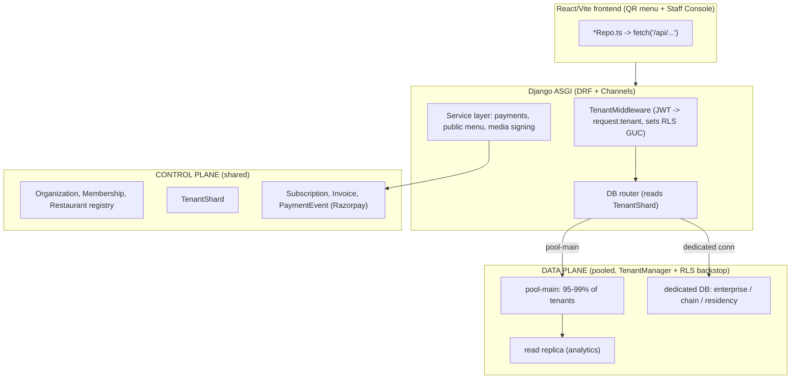

# Relish — Multi-Tenant Restaurant-OS Backend Architecture

**Status:** Approved design · **Stack:** Django + Django REST Framework + PostgreSQL · **Tenancy:** pooled (shared-schema), app-scoped with a Postgres-RLS backstop and a per-tenant routing escape hatch.

> Full table-level entity model lives alongside this doc in [`er-diagram.mmd`](./er-diagram.mmd) (render at https://mermaid.live). This document is the architecture rationale, component map, subsystem designs, security model, and the phased build plan.

---

## 1. Context

Relish is a QR-menu / restaurant-OS product: a React + Vite + TypeScript frontend (a consumer QR menu plus a Staff Console under `src/console/` with admin/manager/waiter roles). The original backend was a **disposable demo** (5 Supabase migrations + a localStorage store) and is being **discarded**. This document specifies the from-scratch replacement.

The product must handle: many restaurants (and chains of outlets), each restaurant's customers, the theme a restaurant chooses, continuous updates, employee management with real role-based access control, photo/video management, logins, and a long tail of operational edge cases.

The frontend stays. Its per-entity repository files (`src/console/lib/*Repo.ts`) are rewritten from Supabase-client calls to `fetch('/api/...')` against the new Django API. The TypeScript domain types in `src/console/lib/types.ts` remain the contract and are regenerated from the DRF OpenAPI schema (`drf-spectacular`) to stay in sync.

---

## 2. Stack & component map

**Backend: Django + DRF. Database: PostgreSQL.** The domain is relational (orders→lines, modifier groups→modifiers, invoices↔subscriptions, reporting via `GROUP BY`); Django brings batteries-included auth/admin/ORM/migrations and an obvious home for the trust boundary (server-side payments, price validation, role checks).

| Concern | Replacement |
|---|---|
| API | **DRF** ViewSets/serializers; a service layer for business logic |
| DB | **PostgreSQL**, region `ap-south-1` (Mumbai) |
| Migrations | **Django migrations**, tracked, staging→prod |
| Tenant isolation | **App-layer scoping**: `TenantManager` + `TenantMiddleware`; **Postgres RLS** as defense-in-depth (session GUC) |
| Auth | **`djangorestframework-simplejwt`** + custom email `User`; **OTP / magic-link** (`django-allauth` or custom OTP) for tablets; phone-OTP for loyalty |
| Storage | **`django-storages` + boto3 → S3 / Cloudflare R2**; presigned upload URLs |
| Image variants | on-the-fly via **imgproxy / Cloudflare Images** (store one original) |
| Video transcode | **Celery + ffmpeg** → 1080/720/360 + poster |
| Realtime (KDS/waiter) | **Django Channels + Redis** (WebSockets) |
| Background jobs | **Celery + Redis** (transcode, invites, loyalty expiry, usage aggregation) |
| Payments | **DRF view** server-side: Razorpay order create + webhook (HMAC `hmac.compare_digest`, idempotent) |
| Provisioning | Django **service function in a transaction** |

**Runtime:** ASGI (Uvicorn/Daphne) so HTTP + WebSockets share a process; behind Nginx; Postgres + Redis; deploy on Fly.io/Render/Railway/VPS.

### Two-lane discipline

- **Lane A — tenant-scoped CRUD:** plain DRF endpoints whose querysets are auto-filtered to the caller's tenant. The bulk of the console.
- **Lane B — trust boundary:** explicit service endpoints with permission classes for anything the client can't be trusted to enforce — payments, role-gated money/HR ops (void/refund/comp, mark invoice, change plan), the **anonymous guest path** (place order / call waiter, prices validated server-side, rate-limited), and media signing.

Money math (`order.total`, line price) lives in the service layer / DB — **never trusted from the client**.

---

## 3. Tenancy isolation model

**Decision: pooled shared-schema, not database-per-restaurant.** On any Postgres platform, "a database per restaurant" at 1000 small venues means schema/DB fan-out (~12,000 tables), per-tenant migration runs with partial-failure handling, catalog/`pg_dump`/autovacuum degradation, and the loss of cheap cross-tenant analytics and billing reconciliation. That is enterprise-isolation cost for SMB workloads.

- **Control plane (shared):** `Organization`, `Membership`, `Restaurant` registry, `Subscription`, `Invoice`, `PaymentEvent`, and a `TenantShard` routing row. One billing source of truth, one webhook target.
- **Data plane (pooled):** every ops model carries `restaurant_id` (and `org_id` where org-scoped). A `TenantManager` auto-filters querysets by `request.tenant`, set by `TenantMiddleware` from the JWT's active membership. A `TenantScopedModel` base + a base `TenantViewSet` make scoping the default so a forgotten filter can't leak.
- **Backstop:** Postgres RLS keyed on a session GUC (`SET app.current_restaurant = …` in middleware) — even a raw query can't cross tenants.
- **Escape hatch:** `TenantShard(restaurant_id pk, shard='pool-main', region, connection_alias)`. 95–99% stay in `pool-main`; a tenant is promoted to a dedicated schema/database — via a Django database router pointed at its `connection_alias` — only when a concrete trigger fires (enterprise chain, contractual data-residency/BYOK, DPDP-grade provable deletion, or a single tenant > ~15–20% of load). Same models, same migrations, **no app rewrite**; promotion/demotion is a data move, never a one-way door.

**By scale:** 10 → pure pool. 100 → pool + `TenantShard` resolver + read replica; first chains on dedicated connections. 1000 → hybrid (~95% pool, a tail of dedicated DBs, a migration runner that applies once to the pool and fans out). Billing stays central throughout. DPDP: one auditable control plane + scoped cascade-delete + audit; `region` + the dedicated-DB hatch cover physical residency/erasure.

---

## 4. Data model — structural decisions

See [`er-diagram.mmd`](./er-diagram.mmd) for every table and column. Key decisions versus the demo:

| Area | Decision | Rationale |
|---|---|---|
| Tenancy | `Organization` above `Restaurant` (an **outlet**). Identity/billing/CRM scope to org; ops to outlet. | Chains, one login, cross-outlet reporting. |
| Identity | One **`Membership`** (org-scoped, nullable `user` so non-login roster staff still exist as FK targets); `MembershipOutlet` assigns a person to ≥1 branch. | Replaces the demo's split `app_users` + `staff`; orders FK a real membership instead of free-text `staff.id`. |
| RBAC | `Role` + `Permission` catalog + `RolePermission`; per-person deltas in `MembershipPermission` (signed `granted`). | Persists the 8 permissions that only lived in TS; enforced by DRF permission classes **and** the service layer. |
| PKs | UUID everywhere; human strings (`T01`, `ORD-00123`) as a separate `code` field, unique per restaurant. | Codes are display ids, not identity. |
| Modifiers | Normalized `ModifierGroup`/`Modifier` + `MenuItemModifierGroup` M:N. | Shared groups, no JSONB duplication. |
| Order lines | `OrderLine` + `OrderLineModifier` are **snapshots** (name/unit_price/label captured at sale; nullable provenance FK). | A sold line must not mutate when the menu changes. |
| Recipes / POs / loyalty | `RecipeLine`, `PurchaseOrderLine` normalized; **`LoyaltyLedger`** (append-only) is truth, `Customer.points/tier/visits/lifetime_spend` are caches. | Aggregation + auditable balance; no concurrent-earn corruption. |
| Money | Integer **minor units** (paise). | Precision + currency safety. |
| Kept JSON | `MenuItem.nutrition`, `AuditLog.before/after`, theme `token_overrides`. | Display-only / frozen / sparse — never joined. |

`restaurant_id` stays on every ops model (the one deliberate denormalization) — it is the tenant-scope key and the realtime partition key.

**Updation / concurrency / deletes:** `created_at`/`updated_at` everywhere; a `version` integer on Realtime-contended models (`orders`, `order_line`, `restaurant_table`, `menu_item`) for optimistic concurrency (stale → 409 → refetch); a generalized `AuditLog` written on high-value mutations; soft-delete (`deleted_at`) for anything referenced by history; hard-delete only ephemeral queues; never delete ledgers/invoices/paid orders.

---

## 5. The four named subsystems

### 5.1 Logins / identity
`Membership` (org-scoped, nullable `user`); custom email `User`; JWT via SimpleJWT carrying the active `membership_id`/`restaurant_id`/`org_id` claims read by `TenantMiddleware`. A tenant switcher re-issues a token scoped to another membership (multi-outlet owner / staff at two venues). Owner self-provisions (`provision_org()` in a transaction → Organization + Restaurant + admin Membership); everyone else is invited (`invite_staff` → emailed token via Celery → accept binds `user`). OTP/magic-link for shop-floor tablets; password reset. **Customers stay phone-only** (anonymous QR scan), with phone-OTP before any loyalty mutation.

### 5.2 Employee management
Roster fields fold into `Membership` (or a 1:1 `StaffProfile`) — one people-model. Permissions persist (`MembershipPermission` + role defaults: admin=all / manager=most / waiter=minimal). `StaffShift` + `Attendance` models. **RBAC enforced server-side**: DRF permission classes on every sensitive endpoint, plus `has_perm()` in the service layer for state transitions (void/refund are dedicated permissioned endpoints, not raw PATCH). Deactivation revokes refresh tokens (JWT blocklist).

### 5.3 Theme management
`RestaurantTheme` (1:1 per outlet): `ui_theme` (warm|hybrid|brutalist|editorial), `component_style` (classic|motion|spectacle), `media_mode` (video|image), logo/cover asset FKs, `token_overrides` JSON (partial patch merged over the base `THEMES[ui_theme]` preset), `allow_customer_choice` + `customer_choices`, plus `draft` JSON + `published` for preview→publish. **Public read path:** an unauthenticated, rate-limited, CDN/Redis-cached `GET /api/public/menu/{restaurant_id}/` returns merged theme + categories + available items + modifiers + logo/cover — **safe fields only** — gated by `is_public = published AND subscription active AND not suspended`. Default: the restaurant chooses (brand identity); opt-in guest choice is constrained to `customer_choices` and persisted in localStorage only.

### 5.4 Photo / media management
`django-storages + boto3 → S3 / Cloudflare R2`. Public prefix (menu images, banners, logo, cover — CDN-served) and private prefix (raw video source). `MediaAsset` (+ `AssetRendition`) model; `MenuItem.image/video`, category banner, logo, cover become asset FKs. Upload: `POST /api/media/sign` → presigned URL (server enforces per-tenant quota + MIME + size) → client PUT → images via on-the-fly transform; video → Celery+ffmpeg renditions → `status='ready'`. Replaces the demo's base64 data-URLs. Bandwidth metering via a `VideoUsage` model + counted beacon.

---

## 6. Security (baked in, not retrofitted)
- **Razorpay webhook:** HMAC via `hmac.compare_digest` (constant-time); idempotent via `PaymentEvent(razorpay_event_id unique)`; failures logged + alerted (never a silent 200 over a failed write).
- **Order create:** authenticated; verify the invoice belongs to the caller's org; rate-limited.
- **RBAC at the API**, not just the UI; `invoices`/`subscriptions` restricted to admin/manager; void/refund/comp are dedicated permissioned endpoints.
- **Anonymous guest path** is read-only on safe fields; any guest-placed order's prices are validated against the DB; rate-limited.
- **Secrets** via env (`django-environ`); Postgres RLS backstop; `ap-south-1` region; customer-phone read restricted to manager/admin (DPDP).

---

## 7. Performance & ops
- Composite `(restaurant_id, …)` indexes on hot paths; partial indexes for open orders / pending requests; `select_related`/`prefetch_related` to kill N+1.
- The public menu/theme JSON is the highest-volume lowest-mutation path — **CDN/edge cache + Redis**, busted on publish. A QR read hits a CDN, not Postgres.
- **PgBouncer** in front of Postgres (Django + Celery + Channels). PITR backups + periodic `pg_dump`. Staging vs prod separation. Sentry + structured JSON logs.

---

## 8. Repo structure (proposed)
Monorepo. Keep the Vite app where it is; add a Django project:
- `backend/` — Django project (`config/`; apps `accounts`, `billing`, `menu`, `ops`, `crm`, `inventory`, `theming`, `media`, `public`, `realtime`), `requirements`/`pyproject`, `manage.py`, `docker-compose.yml` (Postgres + Redis), Celery app, Channels routing.
- `src/` (existing) — frontend; `*Repo.ts` rewritten to call `/api`; types regenerated from `drf-spectacular`.
- `docs/ARCHITECTURE/` — this doc + `er-diagram.mmd`.

---

## 9. Phased build (security-first → identity → public menu → rest)

- **Phase 0 — Scaffold + secure foundation.** Django + DRF + SimpleJWT + Postgres + Redis + Celery + Channels skeleton; `django-environ`; `drf-spectacular`; CI (pytest, ruff, mypy); `docker-compose`. Commit this doc + `er-diagram.mmd`. Razorpay webhook (constant-time + idempotent) and order-create (auth + ownership + rate-limit) built correctly here.
- **Phase 1 — Identity, tenancy & RBAC core.** Org/Restaurant/TenantShard; Membership (+ MembershipOutlet); Role/Permission/RolePermission/MembershipPermission; custom User; `TenantManager` + `TenantMiddleware` + DB router + RLS backstop; `provision_org` + `invite_staff` + OTP; permission classes; staff CRUD; rewire `staffRepo`/`StaffAdmin`.
- **Phase 2 — Public guest path.** `GET /api/public/menu/{id}/` (merged theme+menu, safe fields, `is_public` gate, rate-limit, CDN/Redis cache); wire the QR app + repos.
- **Phase 3 — Theme persistence.** `RestaurantTheme` + endpoints; wire the existing switchers; merge preset←overrides at render.
- **Phase 4 — Media.** S3/R2 buckets; `MediaAsset`/`AssetRendition`; presigned uploads; Celery+ffmpeg transcode; usage metering.
- **Phase 5 — Menu/ops/CRM/inventory + integrity.** Full normalized models; minor-unit money; `version` columns; soft-delete; rewrite remaining repos; Channels live sync (KDS).
- **Phase 6 — Ops & tenancy formalization.** Read replica; PgBouncer; staging; PITR + `pg_dump`; Sentry/structured logs; confirm router + RLS backstop end-to-end.
- **Phase 7 (demand-gated).** Promote the first chain to a dedicated DB; customer real-account upgrade; org-level theme inheritance; reporting rollups; Channels Broadcast scaling.

---

## 10. Verification (per phase)
pytest + DRF tests + Channels tests + the running stack:
1. **Tenant isolation:** two tenants A/B — every endpoint returns only the caller's rows; a non-tenant ORM query + the RLS backstop both refuse cross-tenant reads; `anon` reaches only `/api/public/menu` safe fields.
2. **Identity/RBAC:** invite end-to-end (invite→token→accept→active); toggle a permission → gated endpoint returns 403; one user in two restaurants loads both via the switcher.
3. **Public menu:** scan a published QR → renders anonymously; suspend the subscription → "temporarily unavailable"; cache busts on publish.
4. **Theme/media:** change theme, reload as guest → persists with overrides; upload → S3/R2 (not a data-URL), CDN render, renditions produced, usage increments.
5. **Payments:** replay a test webhook twice → invoice paid exactly once; tampered signature → 400; cross-org order-create → 403.
6. **Concurrency & realtime:** two sessions edit one row → second gets 409 + refetch; place an order → KDS device receives the Channels event live.
7. **Regression/build:** `pytest` green, coverage ≥ 80%; `npm run build` + typecheck green against regenerated OpenAPI types.
